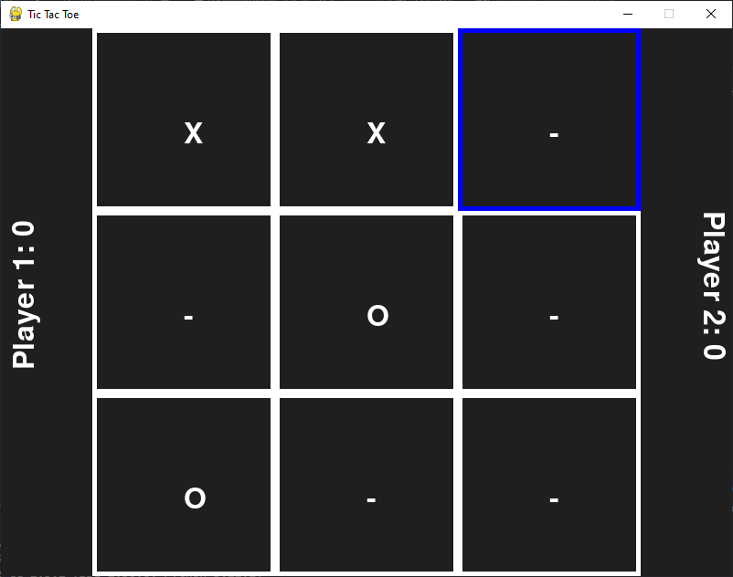

# Tic Tac Toe

the classic tic tac toe game made in python with pygame.

# Download

to play the game, either download the source code from the github release and run the `main.py` file or just download and run the `game.exe` file.